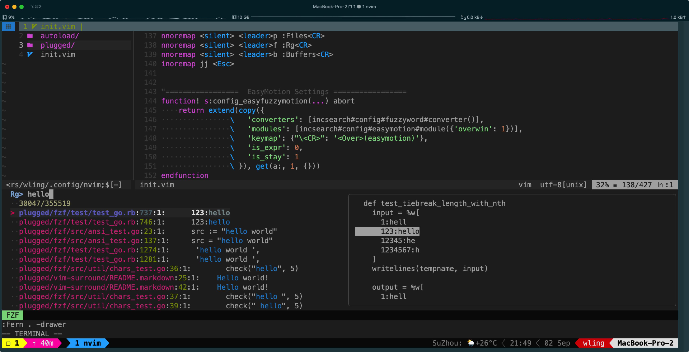

# neovim-cofig
---

This is my Neovim editor setup, with zsh and item2 in hackintosh. 

Below here is a screenshot of my neovim config. The configuration file has not been orgainized structurally and designed for myself.

